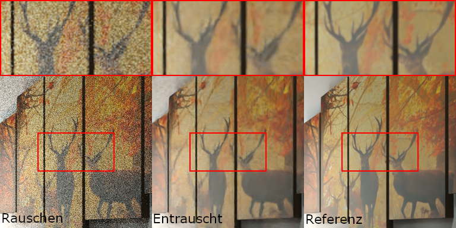
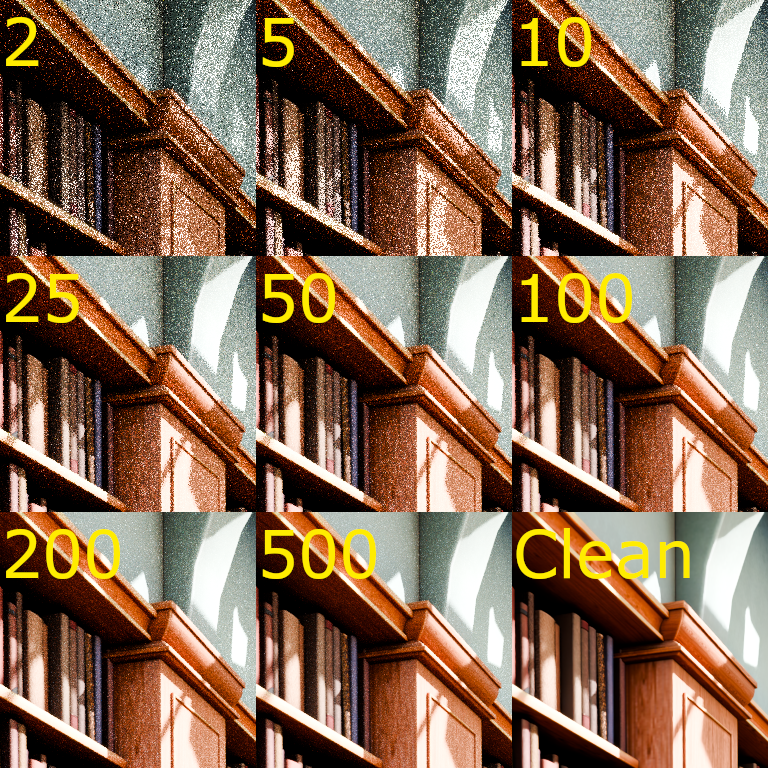

# Path Tracing Denoiser
This repository contains a student project developed as part of a Bachelor's thesis. It focuses on denoising Monte Carlo path-traced images using a convolutional autoencoder. The project includes a trained ONNX model, a GUI application for interactive image denoising and quality evaluation, and scripts for dataset generation and model testing.

## 📦 Downloads Available

You can download the trained ONNX model from the [github release](https://github.com/asyxui/PTDenoising/releases/tag/v1.0).


## Autoencoder model
This project implements a convolutional autoencoder designed to denoise path-traced images. The network takes a noisy RGB patch as input and reconstructs a cleaner version of the image by learning to map noise patterns to their corresponding clean signals. The architecture is based on an encoder-decoder structure with skip connections (U-Net style) to preserve spatial details across layers.

The model is trained using a combination of L1 loss and SSIM (Structural Similarity Index) to balance pixel-wise accuracy and perceptual quality. During inference, the trained model can process images of arbitrary size by operating on non-overlapping patches.

An example below shows a side-by-side comparison of the noisy input, the denoised output, and the ground truth image.



## Dataset
This project uses a custom dataset consisting of noisy and ground truth image pairs for training a denoising autoencoder. The images are rendered using Blender's Cycles path tracer.
- Noisy images: Rendered at low sample counts (2, 5, 10, 50, 100, 200, 500 samples).
- Ground truth images: Rendered at a high sample count with the built-in Blender denoiser enabled to approximate clean results.



Each scene is rendered from multiple camera angles, and images are exported at 1024×1024 resolution. These are then split into 16 non-overlapping 256×256 patches. The patches are saved with filenames that encode the scene, camera index, sample count (for noisy images), and patch index.

## How to setup Python
If you don't have Python 3.11 installed already, download it from https://www.python.org/downloads/release/python-3110/

Specifically Python 3.11 is required for blender.

1. Create a virtual environment in the root folder of the project.
```sh
python -m venv venv
```
2. Activate the virtual environment.
```sh
# Windows (cmd / powershell)
venv\Scripts\activate

# Mac/Linux (bash / zsh)
source venv/bin/activate
```
You will see (venv) appear in your terminal if you've done it right.

3. Install dependencies 
```sh
pip install -r requirements.txt
```
📝 Note: These dependencies are tested for Windows only and expect you to have a CUDA gpu.

## Run Dataset creation script
1. Make sure you have completed the section [How to setup Python](#how-to-setup-python) and have activated the virtual environment.
2. Make sure you have Blender installed and added to path.
3. Make sure you have some blender scenes prepared. (More info below the command)
4. In your terminal, navigate to ./dataset
5. Start the database creation using this command:
```sh
cd dataset
blender -b -P .\blenderDataset.py
```
Blender scenes that will be used for the dataset are stored in /dataset/scenes. You should add this folder and add blender scenes to expand the dataset, I may not share the scenes that were used by me because of the licenses. I suggest packing all resources into the .blend files. Make sure to store them in a folder test, train or val. (for example /dataset/scenes/train/scene.blend)

Once the dataset is created, it can be patched into smaller images for the models using the createPatches.py
```sh
cd dataset
python ./createPatches.py
```

## Train and test model
After generating the dataset a model can be trained like so:
```sh
cd src
python autoencoder_skip_connections.py <num_epochs> --tune
```
--tune optimizes the hyperparameters before training, this takes a long time. The params that I trained and used are available in /src/config/best_hyperparams.json. These parameters are automatically used if you don't add --tune.

📝 Note: Your graphics card might not have enough RAM to use these parameters. If the script appears to hang without generating epochs for more than 10 minutes (but still using all of your gpu), you should reduce the parameters batch_size and base_channels.

To test the model on the test dataset use:
```sh
cd src
python testModel.py
```
Stats about the model can be viewed with TensorBoard
```sh
cd src
tensorboard --logdir=runs
```
then go to http://localhost:6006

## Use the GUI application
The included GUI application allows users to denoise images of any size using the trained ONNX model. Users can load a noisy image, view the denoised result, and cycle through the noisy, denoised, and ground truth versions for visual comparison. Additionally, the BRISQUE quality metric is displayed to provide an objective measure of image quality before and after denoising. The application also supports saving the denoised result and includes basic zoom and pan functionality for inspecting image details.
```sh
cd src
python ./denoiser_gui.py
```