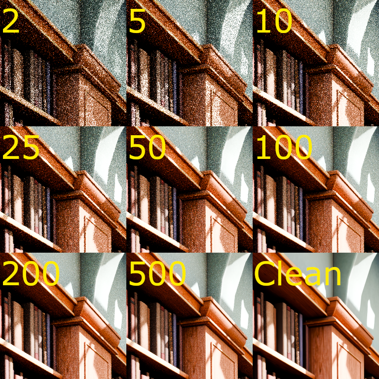

# Path Tracing Denoiser

## Dataset
This project uses a custom dataset consisting of noisy and ground truth image pairs for training a denoising autoencoder. The images are rendered using Blender's Cycles path tracer.
- Noisy images: Rendered at low sample counts (e.g. 2, 5, 10, 50, 100, 200, 500 samples).
- Ground truth images: Rendered at a high sample count with the built-in Blender denoiser enabled to approximate clean results.



Each scene is rendered from multiple camera angles, and images are exported at 1024×1024 resolution. These are then split into 16 non-overlapping 256×256 patches. The patches are saved with filenames that encode the scene, camera index, sample count (for noisy images), and patch index.

## How to setup Python
If you don't have Python 3.11 installed already, download it from https://www.python.org/downloads/release/python-3110/

Specifically Python 3.11 is required for blender.

1. Create a virtual environment in the root folder of the project.
```sh
python -m venv venv
```
2. Activate the virtual environment.
```sh
# Windows (cmd / powershell)
venv\Scripts\activate

# Mac/Linux (bash / zsh)
source venv/bin/activate
```
You will see (venv) appear in your terminal if you've done it right.

3. Install dependencies 
```sh
pip install -r requirements.txt
```

## Run Dataset creation script
1. Make sure you have completed the section [How to setup Python](#how-to-setup-python) and have activated the virtual environment.
2. Make sure you have Blender installed and added to path.
3. In your terminal, navigate to ./dataset
4. Start the database creation using this command:
```sh
blender -b -P .\blenderDataset.py
```
Some demo scenes are provided in ./dataset/scenes. Additional blender scenes may be added to expand the dataset. I suggest packing all resources into the .blend files.

Once the dataset is created, it can be patched into smaller images for the models using the createPatches.py
```sh
python ./createPatches.py
```

## Train a model
After generating the dataset a model can be trained like so:
```sh
cd src
python autoencoder_skip_connections.py <num_epochs> --tune
```
--tune optimizes the hyperparameters before training

To test the model use:
```sh
python testModel.py
```
Stats about the model can be viewed with TensorBoard
```sh
tensorboard --logdir=runs
```
then go to http://localhost:6006